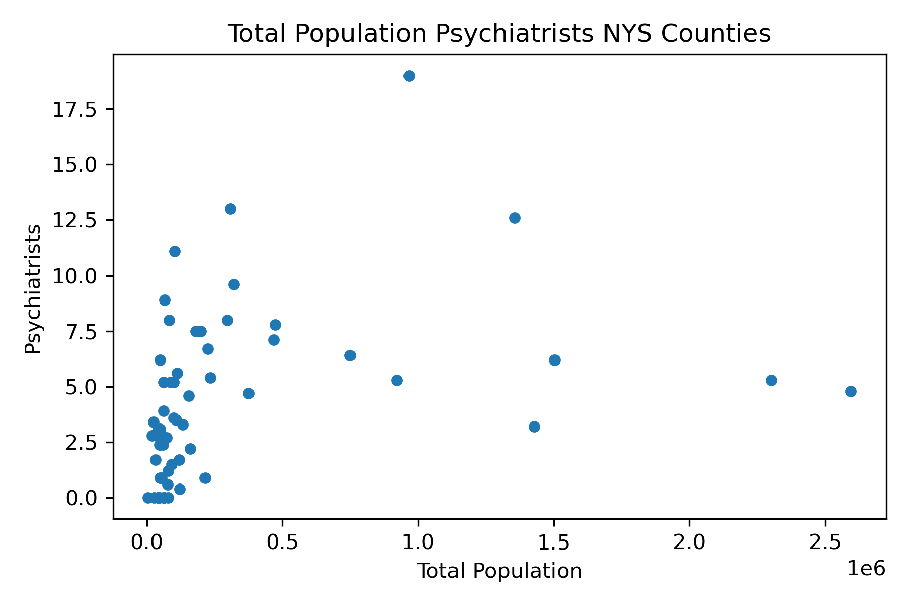
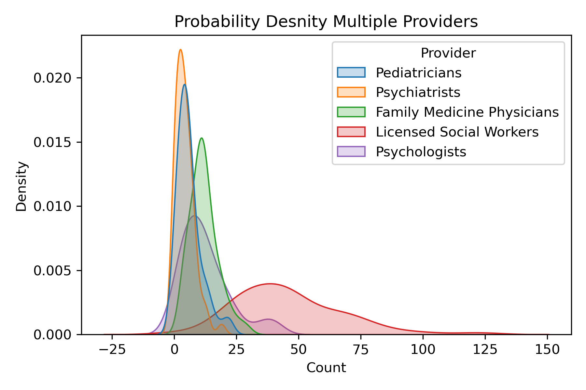
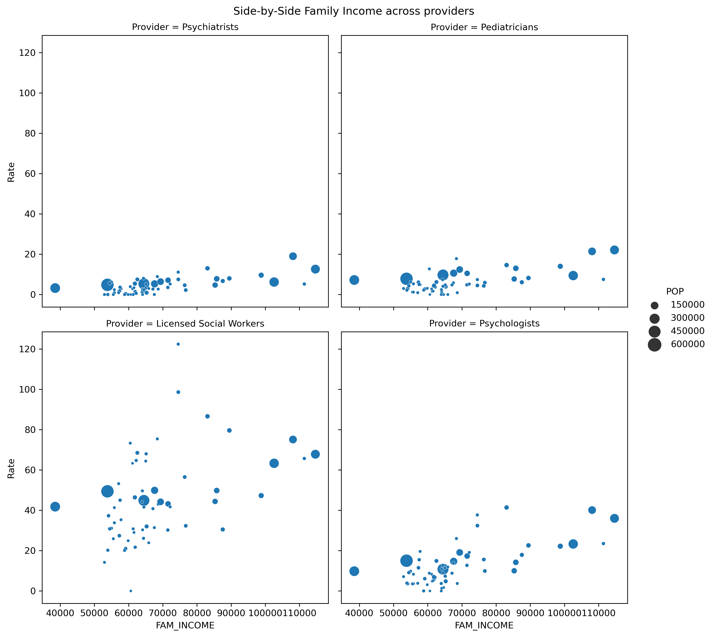

# **New York State: Youth Mental Health Services**
*Are there gaps in youth mental health services in New York State?*

# Summary

This is a description of various health resources available for youth in New York State on a county level. The focus of this data is to accesss mental health resources available for youth specifically under the age of 18. The goal is to note any gaps in availible resources for youth. The methods used to access resources can be applied across states. The results can allow for capacity building measures in under served areas. Additionally, youth and educational policy makers can use this data when designing those policies. When creating policy or programs aimed at youth, it is useful to access the capacity of youth and their supports to engage with the implemented programs.
#
# Input Data

Data for provider information was found on the Center for Disease Control website. [[*Behavioral Health Services in New York, 2015*](https://www.cdc.gov/childrensmentalhealth/stateprofiles-providers/new-york/index.html)]. This data was scraped from  the CDC webpage and exported to a CSV file provided above ''. Census data is collected via an API call to pull in relevant variables such as total population, under 18 population and median family income. The data is provided below.

The CSV file provides data displaying the number of behavioral health services by county in New York State, per 10,000 (ten thousand) kids. 
 
There are five provider types: pediatricians, family medicine physicians, psychiatrists, psychologists and licensed social workers. 

#
# Running Scripts

### *Data_Collection_Under18_Mental_Health_Services.py*

Import and clean data, merge data with left join creating one dataframe with all variables to vizualize and analyze data. 

This should be run first is imports CSV and runs API to get blah blah 

A. Import CSV file 'Behavioral health service providers by county 2015.csv' from the CDC webpage into dataframe **'mental_health_2015'**. 

B. Access Census Information

1. Create API to access census information from 2015, input your requested census key to access tables. 

2. Collect relevant census variables, in this case [`Total Population`] , [`Under 18 Population`] and [`Family Income`] and placed into **census_2015** dataframe. 

3. Change 'census_2015' dataframe column names to match the 'mental_health_2015' and drop unnecessary columns. 

4. Merge dataframes in left hand join to ensure no data is lost. 

5. From this point, the user is able to import relevant variables and try different ratios for whatever analysis you would like to run.

Notes:

In this case there is a ratio of 'total population' divided by 10,000 to access the relationship between providers and youth populations.

Manhattan is dropped as an outlyer, as it does not reflect the average we are seeking to access in this project.  

6. Save dataframe data to a pickle file to use in the next script. 

### *Displaying-Data.py*

this script doesnr do any analysis it just runs figures 

After merging the data into a new dataframe with relevant census variables and provider information, we can access how these variables interact. 

A. Begin by reading in dataframe **youth_MHS.pkl**.

B. There are various data vizualization methods for users including:

- Scatterplots with or without regressions
- Two Panel Comparison Graphs
- Four Panel Comparison Graphs
- Seaborn Relplots
- Density Graphs
- Hex Plots
- Heat Maps (see `maps.py` script below)

*We will use the produced graphs to access the findings of the project. You can compare various graphs to find correlations amoung variables. 

### *maps.py*
Import census county data and heatmap providor information onto the New York State county reprojected map.

A. Download county shapefile from census webpage, download national county file to use different state data later. 

B. Read in shapefile.

1. Filter counties down to [`State 36`] which will be New York State.

2. Reproject the New York State map to serve as an outline for our heat map. 

C. Read in **youth_MHS.pkl**. 

D. Merge data. 

1. Create new dataframe to merge with lefthand join on counties, dropped merge indicator. 

2. Create a gpkg file with the layers argument as `Provider` as we want to vizualize the providers across counties.

E. Create HeatMaps with different providors acorss counties in each map. For clarity include legends, titles and comparison graphs.

#
# Analysis and Results

There are various conclusions we can draw from our data displays. The overarching conclusion is that there are gaps in mental health resources for youth under 18 in various counties within New York State. Regardless of population size there are counties that have the same level of providers which could lead to a lack in resources for youth. The level of providers seems to vary based on family incomes which could speak to inaccessability dependant on wealth. 

There is a strong correlation between pediatritains and phychiatrists 

Note: Graphs display providers per 10,000 Kids

Scatterplot Comparison

Positive correlation with more pediatricians correlated with more psys and scoial workers

Total Population Scatter Plot

Look at total population by Psy after correlation

Density of all providers

Add Family Income variable

Moving forward, we can look for similar variables across underserved counties and see if there are correlations. Additionally, looking at the average case load of providers would offer a better estimate if youth are truly being underserved. 

If there are gaps within mental health resources for youth, this could be relevant for policy makers who want to improve access. If programs and polices are reliant on community supports it would be necessary to knwo the supports in place, to know whether capacity building is necessary. 

