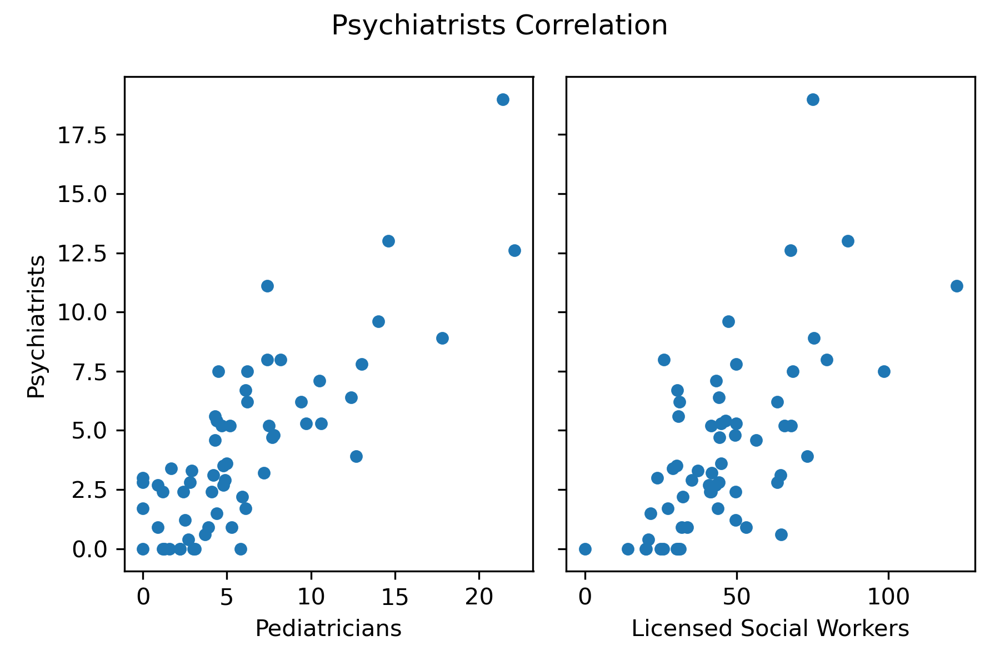

# **New York State: Youth Mental Health Services**
*Are there gaps in youth mental health services in New York State?*

# Summary

This is a description of various health resources available for youth in New York State on a county level. The focus of this data is to access mental health resources available for youth specifically under the age of 18. The goal is to note any gaps in available resources for youth. The methods used to access resources can be applied across states. The results can allow for capacity building measures in under served areas. Additionally, youth and educational policy makers can use this data when designing those policies. When creating policy or programs aimed at youth, it is useful to access the capacity of youth and their supports to engage with the implemented programs.
#
# Input Data

Data for provider information was found on the Center for Disease Control website. [[*Behavioral Health Services in New York, 2015*](https://www.cdc.gov/childrensmentalhealth/stateprofiles-providers/new-york/index.html)]. This data was scraped from the CDC webpage and exported to a CSV file provided in the files tab `Behavioral health service providers by county 2015.csv`.The CSV file provides data displaying the number of behavioral health services by county in New York State, per 10,000 (ten thousand) kids. There are five provider types: pediatricians, family medicine physicians, psychiatrists, psychologists and licensed social workers. 

 Census data is collected via an API call to pull in relevant variables such as total population, under 18 population and median family income. The call instructions are provided in the below script below.

#
# Running Scripts

### *Data_Collection_Under18_Mental_Health_Services.py*

Run this script first to import the CSV file containing provider information within New York State counties. This script runs an API that collects relevant census variables, in this case `Total Population` , `Under 18 Population` and `Family Income`. The script cleans data, merges data with a left join and saves to a pickle file to import into the next script. 

Note:

* In this case there is a ratio of 'total population' divided by 10,000 to access the relationship between providers and youth populations.

* Manhattan is dropped as an outlier, as it does not reflect the average in this project.  

### *Displaying-Data.py*

Run this script next to display relevant data in various ways. This script does not analyze the data but offers a variety of figures explaining the findings. 

Visualization methods include:

- Scatter plots with or without regressions
- Two Panel Comparison Graphs
- Four Panel Comparison Graphs
- Seaborn Relplots
- Density Graphs
- Hex Plots
- Heat Maps (see `maps.py` script below)

### *maps.py*

Run this script last to produce heat maps displaying New York State counties and provider information as collected in the scripts again. This script does not analyze data but produces heat maps. 

#
# Analysis and Results

The data seems to show gaps in mental health resources for youth under 18 in various counties within New York State. Population size does not seem to match providers within the county, as larger counties and smaller counties have similar provider counts or smaller counties have a lower number of licensed providers. The level of providers vary based on family income across counties, there are more providers in affluent areas. These factors are explored below and create gaps within youth resources.

Pediatricians are likely to refer children to specialists such as Psychologists and Psychiatrists. Social Workers are typically the gate keepers for youth and resources. They are typically called upon to report to authorities and report abuse to child protection service. 

I will be focusing on pediatricians, psychiatrists, psychologists and licensed social workers for this analysis. Family medicine physicians are not the majority of mental healthcare providers so we will look at the impact of other providers. 

##### *Note: Graphs display providers per 10,000 Kids*

**Scatter Plot Comparison**

The above graph shows the comparison between two individual scatter plots. Each plot shows a positive correlation between Psychiatrist and Pediatricians which compares to the correlation between Psychiatrists and Licensed Social Workers. We can assume there is a positive correlation across pediatricians and other providers.

**Total Population Scatter Plot**

Looking at total population from the census data, we can see a concentration of Psychiatrists in low population areas whereas higher population areas average between 5-7.5 per 10,000 kids. As seen in the above scatter plots, there is a positive correlation between Psychiatrists,  Pediatricians and Licensed Social Workers. This leads us to believe there are some lacking resources for higher population areas, though it would be best to run an `under_18` variable to access the full effect on youth.

**Density of All Providers**

The findings in the 'Total Population Scatter Plot' are supported in the above 'Density of All Provider'. Throughout this graph, we can see there is a dispersed density of social workers though there are far less than other providers. This means you'll have a higher likelihood of finding either a Pediatrician, Psychiatrist, Family Medicine Physicians or Psychologist however only in very specific counties. Whereas, there is a higher chance of finding a License Social Worker across the counties.

**Family Income Variable**

After adding in the medium family income variable from the census data, I compare the main four providers against median family income among the counties populations. Plots displaying Pediatricians and Psychiatrists are similarly scattered and Licensed Social Workers are similarly displayed.

In the Psychiatrists plot we can see a concentration around the $50,000 - $60,000 income range with an average of approximately 5-10 providers. There are some outliers as we can see in the higher income ranges which are still seen hovering within the 10 providers range. This trend is similar for the Pediatricians range with similar outliers within the higher income range. 

Contrary to the referenced plots, we can see a dispersed range among the Licensed Social Worker plot. There is a higher concentration of social workers among the $50,000 - $60,000 salary range. The data has more outliers than the other plots. There seems to be average of 40-50 providers however there are many outliers that have more or less providers per population. There are some counties that have similar populations and less providers in addition to counties that have the same population size with higher income and more providers. After the side-by-side comparisons, we can see there is a clear connection between income and providers. 

Moving forward, we can look for similar variables across underserved counties and see if there are correlations. Additionally, looking at the average case load of providers would offer a better estimate if youth are truly being underserved. 

If there are gaps within mental health resources for youth, this could be relevant for policy makers who want to improve access. If programs and polices are reliant on community supports it would be necessary to knwo the supports in place, to know whether capacity building is necessary. 

worry about ppl who have lower family income because afluent ppl have LSW. 

Theres some gaps especially if ppl are supposed to be abel to have lsw at 50 but larger and smaller counties are not equal in the amount they have. 

Are the counties low on social workers low on the other providers? 
Population dencity not analyzsed here but could be a big factor- degree of population density 

Say more about what you see

